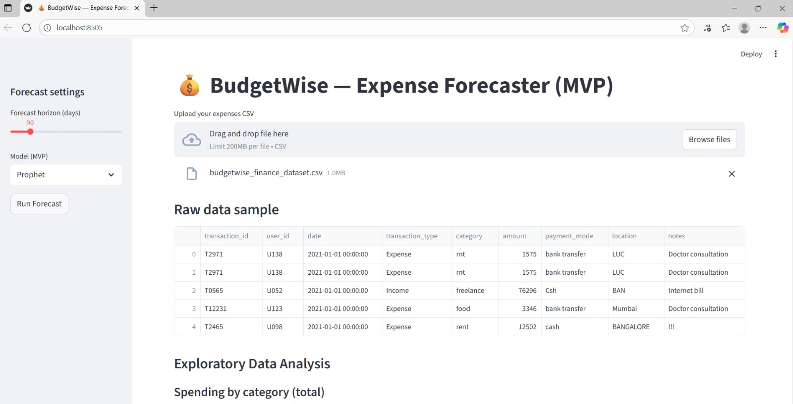
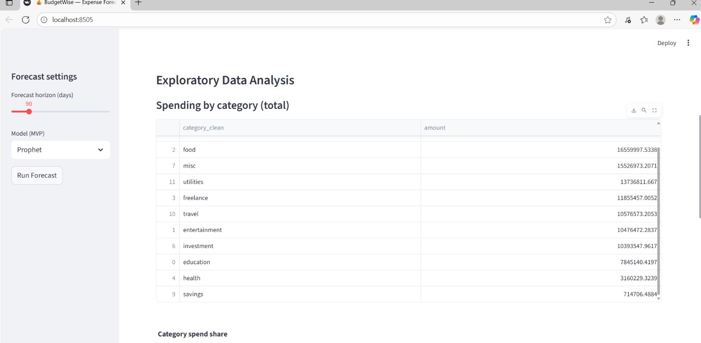
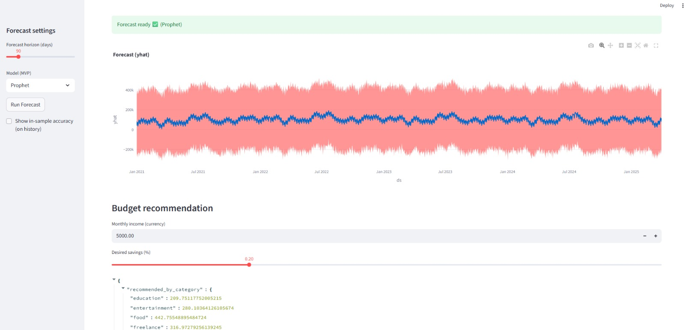
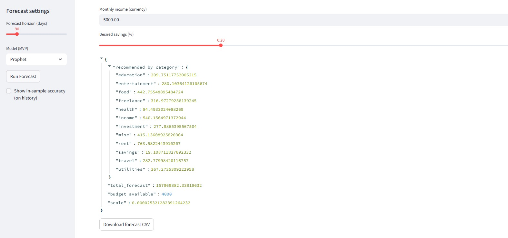
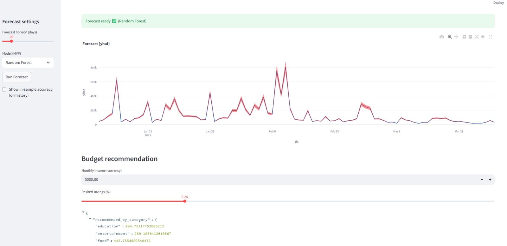
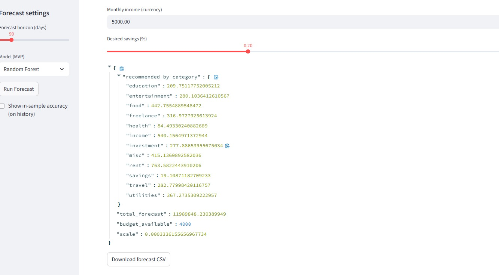
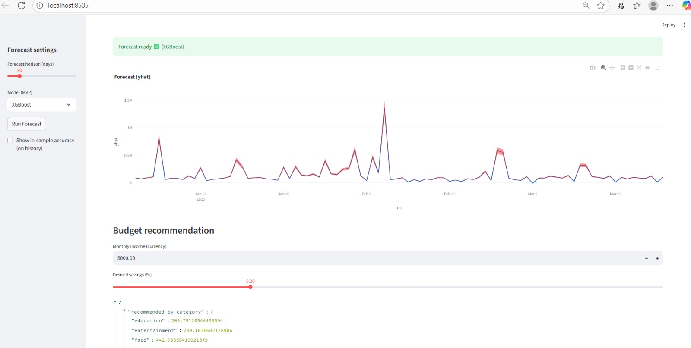
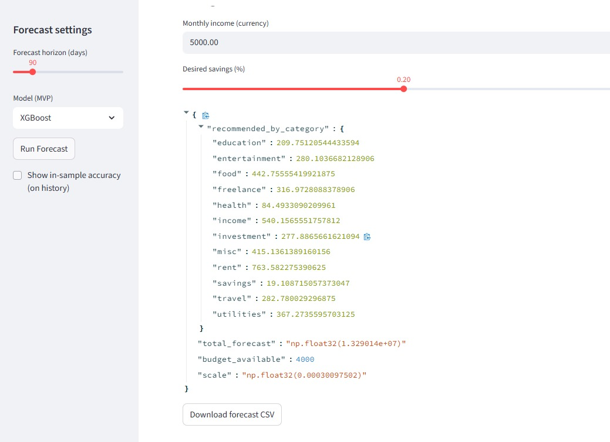

# 💰 BudgetWise - AI Expense Forecaster

## 📌 Project Overview
BudgetWise is a machine learning + deep learning powered application that forecasts personal expenses and suggests budget allocations.

It includes:
- Data preprocessing
- Time series forecasting (Prophet, ARIMA, ML, DL, Transformers planned)
- Budget optimization module
- Streamlit dashboard for interactive visualization

---

## 📂 Project Structure
D:\ML_PROJECT_SESSION
│── data\ # raw & processed datasets
│── notebooks\ # Jupyter notebooks (EDA, experiments)
│ └── eda.ipynb
│── src\ # source code
│ ├── preprocessing.py
│ ├── models.py
│ ├── forecasting.py
│ ├── budget_optimizer.py
│ └── app.py
│── tests\ # unit tests
│── README.md # project documentation
│── requirements.txt # dependencies

## Screenshots

### Upload Expenses

### EDA - Spending by Category

### EDA - Time Series

### Forecast Ready

### Budget Recommendation - Education & Entertainment

### Budget Recommendation - Food & Freelance

### Budget Recommendation - Health & Income

### Budget Recommendation - Investment & Misc

### Budget Recommendation - Rent, Travel, Utilities
